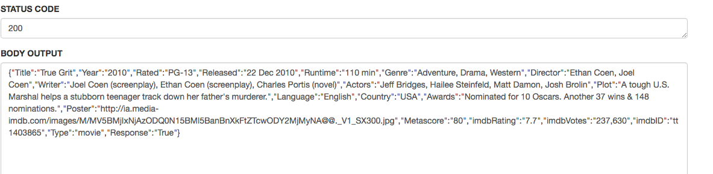
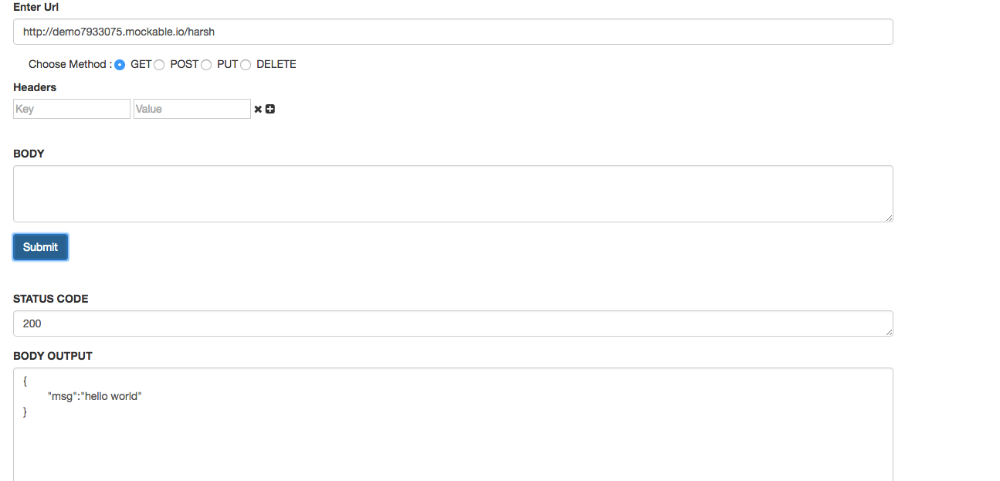
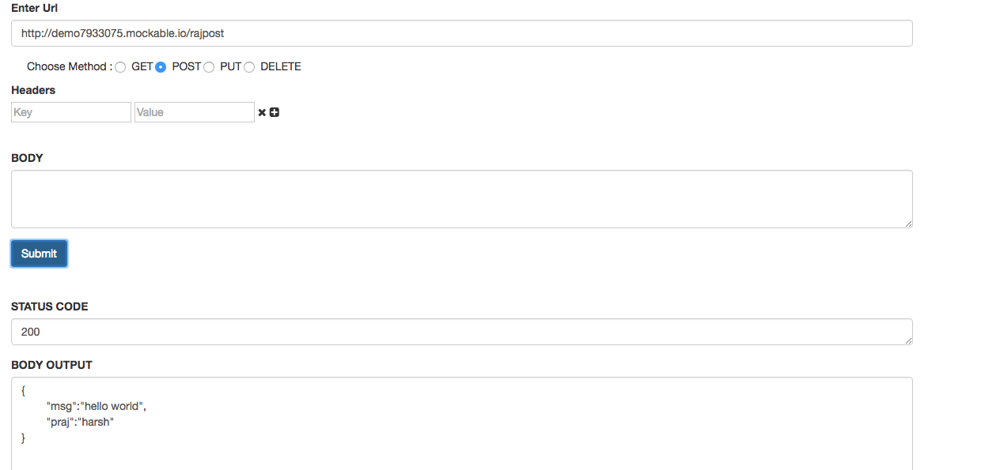
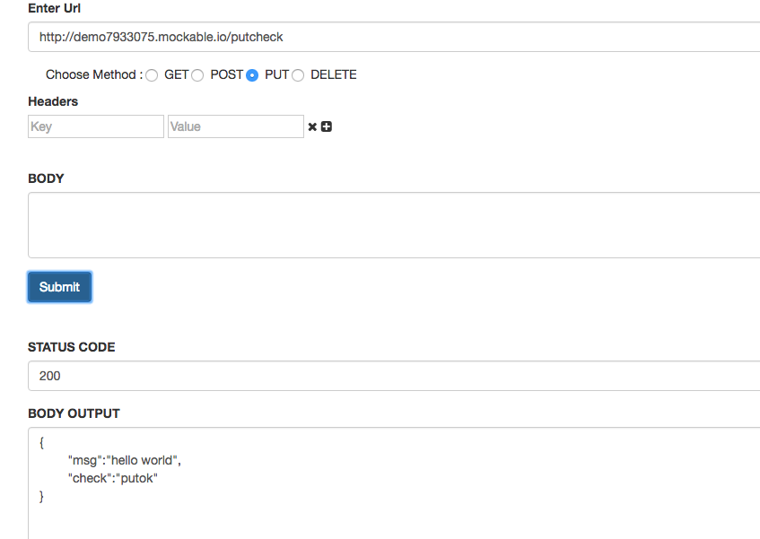
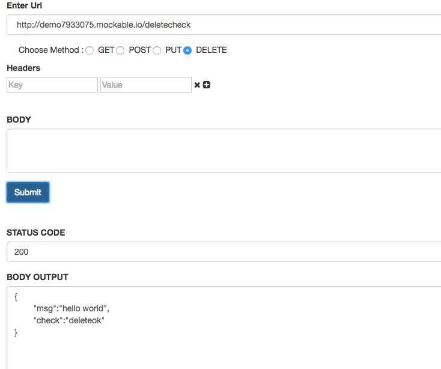

************ Start of the Project *********************

Restapi-->
Restapi is a pure javascript based chrome extension to make HTTP Get, Post, Put and Delete requests to a particular URL .

	-	GET
	-	POST
	-	PUT ,DELETE

Version Released
	-	1.0.0

Tech
	-	Restapi chrome extension used languages:

	[JS]         -   HTML enhanced for web apps!
	[HTML]       - 	 Awesome web-based text editor
	[BOOTSTRAP]  -   Markdown parser done right. Fast and easy to extend.
	[jQuery] 	 -   For event listener

Installation-->
1.Clone the repo and then click on the Developer mode in Google Chrome and Click on load unpacked extension. -->
2 After that restapi name extension shown in your extensions. -->
3 Click on Options in that extension.A new page is open after clicking on option. -->
4 Enter the URL after selecting GET and POST option you will get the result. -->
5.We can also choose headers.

In this project I use mockable.io for testing server calls like get,post,put delete.

--> Create a account on mockable.io 
--> Click on rest mock to create requests.
--> After saving this we can get the url for get ,put,delete and post request.